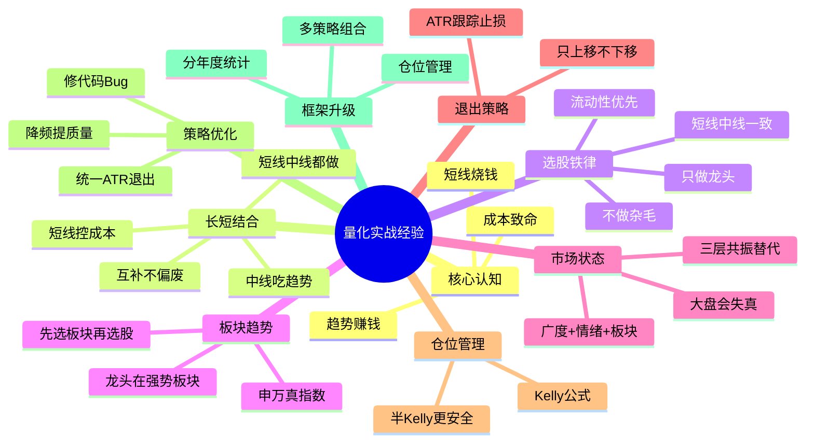

# 量化交易系统设计文档

> 基于 9 策略 × 30 只 A 股 × 5 年回测（2021-2026）验证总结
>
> 本文由 `EXPERIENCE.md` + `STRATEGY_GUIDE.md` + `ROADMAP.md` 三文合并去重而成，分三部分：
> - **第一部分 经验档案** — 回测数据结论与策略设计经验（历史 9 策略已删，结论仍成立）
> - **第二部分 策略理论** — 信号分级 / Kelly / ATR 止损 / 七层闭环架构（唯一理论权威）
> - **第三部分 演进路线** — 阶段 1-4 + 技术债务清单

---

# 第一部分：经验档案

> **代码现状说明**：项目最初有 9 个独立策略，经多轮重构已收敛为**单一 `midterm` 复合策略**
> （七层闭环，详见本文第二部分），把趋势/震荡/过滤/退出集成在一条策略里。旧 9 策略均已删除，
> 但回测数据结论与策略设计经验仍然成立，只是落地方式从"多策略组合"变成"单策略七层闭环"。
> 下文提及 ma/macd/rsi 等策略名时指历史策略档案，非当前代码。

## 经验脑图



---

## 一、核心认知：趋势赚钱，短线烧钱

### 1.1 回测数据证明

```
策略          持仓周期    5年收益    年交易数    年成本占比    结论
──────────────────────────────────────────────────────────────
MA            ~30天      +2.9%      12次/年   2.2%       中线但退出差
ADX           ~25天      -4.7%      14次/年   2.5%       中线回撤最低19%
Turtle        ~20天      +3.8%      18次/年   3.2%       中线逻辑对
MACD          ~15天      +14%       24次/年   4.3%       最好的一个
RSI           ~8天       +11.6%     45次/年   8.1%       偏短线
KDJ           ~5天       -30%       72次/年   26%        短线亏钱
OBV           -          -16%       -         -          无效
```

### 1.2 成本是短线策略的致命伤

```
单边手续费 = 佣金万3 + 印花税千1(卖出) + 过户费 + 滑点 ≈ 0.18%

  中线策略: 24次/年 × 0.36%(双边) = 8.6% 年成本   ← 可接受
  短线策略: 72次/年 × 0.36%(双边) = 26%  年成本   ← 吃光利润

  KDJ 5年亏30%，其中26%是手续费
  → 如果0手续费，KDJ可能只亏-4%
  → 短线策略年收益必须超过50%才能盈亏平衡
```

### 1.3 趋势策略的数学优势

```
趋势策略: 一次大利润覆盖多次小止损
  一波行情赚30%，止损3次各亏3% = 30% - 9% - 1% = +20%

短线策略: 小利润高频次，成本海量
  每次赚2%，亏1次3%，做10次 = 20% - 3% - 18% = -1%

结论: 市场上赚钱的都是玩趋势，短线太凶狠要果断
```

---

## 二、中线 vs 短线策略对比

| 维度 | 中线策略 | 短线策略 |
|------|---------|---------|
| 持仓周期 | 2周~3个月 | 1~5天 |
| 年交易次数 | 10~20次 | 100~250次 |
| 年成本占比 | ~4% | ~45%+ |
| 胜率范围 | 35~45% | 50~60% |
| 盈亏比 | 2:1~4:1 | 1:1~1.5:1 |
| 核心指标 | 盈亏比 > 胜率 | 胜率 > 盈亏比 |
| 最大风险 | 利润回吐 | 成本吃光利润 |
| 优化重点 | 改退出(减少回吐) | 降频+降本 |
| 适合市场 | 趋势市 | 震荡市(但成本高) |

**期望值对比**：

```
中线: 胜率40%, 盈亏比2.5 → 每笔+0.40R, 年8R, 扣成本≈+4%
短线: 胜率55%, 盈亏比1.2 → 每笔+0.21R, 年21R, 扣成本≈-24%  ← 成本吃光利润
```

---

## 三、退出策略是最大杠杆点

### 3.1 各策略退出方式的问题

| 策略 | 退出方式 | 问题 |
|------|---------|------|
| MACD | 死叉退出 | 利润回吐50%+ |
| MA | 均线死叉退出 | 滞后严重 |
| RSI | 超买退出 | 利润薄 |
| Turtle | 10日低点突破 | 震荡市反复止损 |
| OBV | OBV下穿均线 | 5年-16%，无效 |
| ADX | -DI穿越+ADX跌破 | 退出也滞后 |
| KDJ | 死叉/ATR止损 | ATR太紧被洗(3.5×ATR最好) |
| TrendRider | ATR跟踪止损 | ← 已验证有效 |

### 3.2 ATR跟踪止损是统一解法

```
入场: 各策略自己的信号 (保持差异)
退出: 统一ATR跟踪止损 (3.5×ATR, 只上移)

核心原则:
  1. 止损线只往有利方向移动（上移），不下移
  2. 趋势没结束就不走，不被小波动洗出
  3. 触碰止损 = 机械执行，不分析、不犹豫

ATR倍数选择:
  ADX > 30 (强趋势)  → 3.0~3.5×ATR (宽止损，吃满趋势)
  ADX 20-30 (弱趋势) → 2.0×ATR (适中)
  ADX < 20 (震荡市)  → 不交易
```

> midterm 已落地：`framework/factors/exit.py` 的 `build_exits` 实现 ATR 跟踪止损（只上移），ADX 决定倍数。

### 3.3 已验证的数据

```
KDJ+ATR (3.5×ATR) 在宁德时代: 收益 +130%, 盈亏比 3.65, 胜率 40%  ← 趋势市表现好
KDJ+ATR (3.5×ATR) 在平安银行: 收益 -5%, 盈亏比 0.86             ← 震荡市表现差
→ ATR止损在趋势市有效，震荡市需要ADX过滤
```

---

## 四、市场状态决定策略选择

### 4.1 A股2021-2026市场特征

```
上证指数:  3500 → 3300  (横盘震荡)
沪深300:   5500 → 3900  (跌29%, 熊市)
创业板指:  3100 → 2100  (跌32%, 但中间有反弹)
中证1000:  7000 → 6000  (跌14%, 小盘相对抗跌)

→ A股这5年是熊市/震荡市
→ 趋势策略在熊市中频繁假突破
→ 均值回归(RSI/KDJ)在震荡市有优势，但成本太高
→ 最佳方案: ADX判断市场状态，趋势市才做趋势策略
```

### 4.2 ADX是最有效的市场状态过滤器

```
ADX策略5年回撤只有19%，所有策略中最低
→ 说明ADX判断市场状态是有效的

过滤规则:
  ADX > 25  → 趋势市 → 用MACD/TrendRider/Turtle
  ADX < 20  → 震荡市 → 空仓或RSI(降频后)
  ADX 20-25 → 不明朗 → 空仓等待
```

---

## 五、仓位管理是降回撤的关键

```
当前: 100%仓位进出
  → 单笔亏损6% = 组合回撤6%
  → 连续3笔亏损 = 回撤18%
  → 这就是为什么所有策略回撤都在27-45%

改为30%仓位:
  → 单笔亏损6% × 30% = 组合回撤1.8%
  → 连续5笔亏损 = 回撤9% (vs 满仓30%)
  → 收益降到30%，但Sharpe可能更高
```

> Kelly 仓位理论见本文第二部分第三章。**当前 midterm 未接入 size 仓位层**（`generate()` 不返回 size，回测走等权满仓），Kelly/分级/ADX 仓位是理论目标与未来接入项。

---

## 六、代码级Bug和隐患（历史档案）

> 9 策略时期的代码问题，已通过"删冗余策略 + 基类模板方法重构"解决——只保留 midterm，
> 公共指标(MA系统/量比)上提到 `Strategy` 基类，ATR/ADX 统一到 `framework/factors/exit.py`。
> 下表保留作历史档案。仅 #6/#9 两项仍待办。

| # | 问题 | 历史文件 | 现状 |
|---|------|------|------|
| 1 | 日期硬编码 `20260101`-`20260818`，`--start/--end`被忽略 | `optimize.py` | 已修 |
| 2 | ATR计算重复三份，改一个忘改另外两个 | `trend_rider.py`/`kdj.py`/`adx.py` | 已删，统一到 `factors/exit.py` |
| 3 | KDJ死参数 `ma_period` | `kdj.py` | 已删 |
| 4 | `optimize.py` 的 `PARAM_GRIDS` 缺 kdj/trend_rider | `optimize.py` | 已修，只留 midterm grid |
| 5 | RSI阈值40/60非标准 | `rsi.py` | 已删 |
| 6 | `batch_backtest.py` 没有传 `sl_stop/tp_stop` | `batch_backtest.py` | 待办 |
| 7 | Regime策略MA画在副图不在主图 | `regime.py` | 已删 |
| 8 | Turtle进出场用同一周期(20/20) | `turtle.py` | 已删 |
| 9 | 成本模型不精确（无最小手续费、无过户费区分） | `run.py` | 待办 |

**框架级缺失（部分已补）**：✓ 看板可视化 + 信号分级理论 + 成交量确认(基类VR+量比过滤)；✗ 仓位管理（理论已定，未接入 midterm）/ 分年度统计 / 组合回测 / 并行执行 / 指数ETF数据。

---

## 七、策略优化优先级（历史清单）

> 9 策略时期的优化清单，大部分已通过"删冗余策略 + 收敛到 midterm"解决。

- **紧急修bug(①-⑤)**：①日期硬编码→已修；②④⑤ kdj/regime/trend_rider 网格与死参数→策略已删，只留 midterm grid；③ ATR 重复三份→统一到 `factors/exit.py`。
- **高收益改进(⑥-⑩)**：⑥ 统一 ATR 退出→midterm 已是统一退出；⑨ ADX 过滤→midterm 第4层用 ADX 定止损宽度；⑩ 量比确认→已落地(量比>1.2入场过滤+基类VR)；⑦⑧ 策略已删。
- **框架升级(⑪-⑭)**：⑪ 仓位管理→理论已定(Kelly×ADX+分级)，**midterm 尚未接入**；⑫分年度统计/⑬并行/⑭指数ETF→待办（见本文第三部分）。

---

## 八、不建议现在做的

| 优化点 | 原因 |
|--------|------|
| 参数优化器 | 容易过拟合，先确认策略逻辑对再优化参数 |
| 蒙特卡洛 | 锦上添花，不是当前瓶颈 |
| 扩展到100+股票 | 数据成本高，30只够验证逻辑 |
| 分钟级数据 | T+1限制下意义不大 |
| 基本面因子 | 复杂度高，当前框架不支持 |
| 游资打板策略 | 需要分时数据+涨停板标记+情绪指标，数据成本高，回测困难（涨停板买不到） |

---

## 九、游资战法 vs 量化框架

```
量化趋势策略:           游资打板战法:
  日K线级别               日内/隔日级别
  持仓数周到数月          持仓1-3天
  信号: 金叉/突破/超买超卖  信号: 涨停板+量能+情绪周期
  年交易10-20次           年交易100+次
  年成本~4%              年成本~45%+
  适合: 大资金            适合: 小资金
```

游资战法量化难点：需要分时数据/涨停板标记/连板统计/板块题材分类/市场情绪指标（当前都不支持）；回测陷阱是涨停板买不到是常态，假设涨停价能买到会高估收益。

---

## 十、关键经验总结

### 10.1 五条铁律

```
1. 趋势赚钱，短线烧钱 — 短线成本高，但长短都做，短线靠降频+控成本活下来
2. 退出比入场重要 — ATR跟踪止损是最大杠杆点
3. 不分市场状态的策略都是耍流氓 — ADX过滤是必须的
4. 满仓进出是回撤根源 — 仓位管理能降回撤60%+
5. 先验证逻辑再优化参数 — 过拟合比没有策略更危险
```

### 10.2 长短线策略配置建议

> 历史 9 策略配置经验，当前已收敛为单一 midterm（七层闭环集成"中线趋势为主 + ADX 过滤 + 量比确认"）。
> 旧策略去向：MACD/KDJ → 并入 midterm 信号层；ADX → midterm 第4层环境；MA/Turtle/RSI/OBV/Regime/TrendRider → 已删。

核心原则：长短结合不偏废，但都只做龙头、都控成本。趋势市中线权重高(70%)，震荡市短线权重高(但必须降频，否则成本吃光)，不明朗都降仓等信号。

> 注意: 拒绝的不是"短线策略"本身，而是"高频烧成本的短线"。短线通过降频(年交易<30次)+控成本后仍有配置价值。

### 10.3 优化执行顺序

> 9 策略时期的执行计划，前 3 步已通过 midterm + 基类重构落地，后 3 步待办。

第1步 修bug → 第2步 统一ATR退出 → 第3步 ADX过滤（均已完成）；
第4步 仓位管理 → 第5步 分年度统计 → 第6步 组合（待办，见第三部分）。

---

## 十一、选股铁律：只做龙头，不做杂毛

### 11.1 核心原则

```
无论短线还是中线，选股只追求一件事：流动性（辨识度）。
  → 只做龙头股，不做杂毛股
  → 龙头 = 板块最强、成交最大、关注度最高
  → 杂毛 = 跟风的、成交稀薄的、没人看的
```

龙头 vs 杂毛：

| 维度 | 龙头股 | 杂毛股 |
|------|--------|--------|
| 成交量 | 日均10亿+ | 日均1亿以下 |
| 买卖冲击 | 滑点小(<0.1%) | 滑点大(0.5%+) |
| 涨跌停 | 封板坚决, 进出容易 | 封板犹豫, 被砸即开 |
| 资金关注 | 大资金进出自由 | 大资金进不去/出不来 |
| 趋势持续性 | 一波主升浪清晰 | 涨一天跌三天 |
| 信号质量 | 突破是真突破 | 突破大概率是假突破 |

同样一个 MACD 金叉信号：在龙头股上胜率45%/盈亏比3:1，在杂毛股上胜率30%/盈亏比1:1——选股层的收益差距比策略层更大。

### 11.2 如何定义"龙头"（量化筛选）

```
龙头股的量化特征 (每日筛选):
  ① 成交额排名: 全市场前5% (日均成交 > 行业均值3倍)
  ② 涨幅排名:   板块内当日涨幅前3
  ③ 换手率:     3%-15% (太低没量, 太高出货)
  ④ 板块地位:   板块启动日率先涨停/领涨
  ⑤ 连板高度:   有连板梯队(至少2板)才确认主线

杂毛的特征 (直接排除):
  ✗ 日均成交 < 2亿
  ✗ 板块内跟涨(龙头涨它才涨, 龙头跌它先跌)
  ✗ 无辨识度(没有机构/游资关注)
  ✗ ST / 退市风险 / 流动性枯竭
```

### 11.3 选股铁律的优先级

```
交易决策优先级 (从高到低):
  1. 选股: 只做龙头, 流动性第一     ← 最底层, 决定生死
  2. 市场状态: ADX过滤, 震荡不做    ← 决定方向
  3. 策略: MACD/Turtle趋势为主      ← 决定买卖点
  4. 退出: ATR跟踪止损              ← 决定赚多少
  5. 仓位: 半Kelly                  ← 决定回撤

  → 选错股 (杂毛), 后面全错
  → 选对股 (龙头), 即使策略粗糙也能赚
```

---

## 十二、中期策略落地（设计稿 → 已实现）

> 原 ch12~ch15 是中期量化完整设计稿（四层架构 / 因子总表 / 因子处理细则 / 七层闭环 v2），
> 共约 500 行，**已落地为 `midterm` 策略**（`framework/strategies/midterm.py`）。
> 设计原理与七层架构表见本文第二部分，此处不重复。

### 落地要点

- **七层闭环**：闸门(情绪/板块温度) → 板块 → 龙头 → 信号(周KDJ+MACD+MA+量比) → 环境(ADX+ATR定止损宽度) → 退出(ATR跟踪/量价背离) → 仓位(Kelly×ADX系数)。详见第二部分。
- **当前接入状态**：个股信号层(第3层) + 退出(第5层) 已在 `midterm.generate()` 实现（信号因子 `_macd/_weekly_kdj/_ma_trend/_volume_ratio` 内联在 midterm.py）；跨股票过滤层(闸门/板块/龙头)的因子库已建(`framework/factors/market_state.py`/`sector_trend.py`/`leader.py`)，**默认全关**，逐个开启观察效果。**仓位层(第6层) Kelly 理论已定但尚未接入**——`generate()` 不返回 size，回测走等权满仓。
- **因子库**：纯函数（日K进，等长对齐 Series 出），见 `framework/factors/`。
- **代码重构史**：基类模板方法（`run()` 骨架 + 子类 `generate()` 钩子 + `SignalResult`，公共指标 MA系统/量比由基类统一组装）→ 信号因子从 `factors/signal.py` 内联进 midterm.py（signal.py 已清空）。详见 git log。

### 验证状态

```
✓ 单股 run() 返回固定 5 元组 (size=None), 回测无异常 (代码示例 000001 短区间)
✓ 架构: 基类模板方法 (run 骨架 + generate 钩子), 引擎零改动
✓ pytest tests/ 全绿 (test_base + test_strategies, 18 项)
⏳ 全量回测待执行 (用户要求先搞代码、暂未跑)
```

---

# 第二部分：策略理论

> 本文是理论/设计权威。信号分级、Kelly 仓位、ATR 止损、多策略组合等均为设计原理，
> 非当前代码实现清单。当前项目已收敛为**单一 `midterm` 复合策略**（见首节"七层闭环架构"），
> 把趋势信号 + ADX 过滤 + 量比确认 + ATR 退出集成在一条策略里。下文第四章的"多策略组合"是
> **组合理论**，当前未做多策略组合实现。

## 七层闭环架构

```
第0层 闸门:  F3 板块温度 & F1 个股广度 (满足2个才开仓)
第1层 板块:  F4/F5 板块趋势 (强势板块)
第2层 选股:  F6-F9 龙头筛选 (强势板块内只选龙头)
第3层 信号:  周KDJ多头 & MACD金叉 & MA向上 & 量比>1.2
第4层 环境:  ADX+ATR (决定止损宽度, 不投票)
第5层 退出:  ATR跟踪止损 / MA止损 / 量价背离
第6层 仓位:  由回测引擎 size 控制 (理论已定, 当前等权满仓)
```

跨股票状态(广度/板块/龙头)在模块级缓存, 避免每只股票重算全市场。

---

## 核心公式

```
期望收益 (EV) = 胜率 × 平均盈利 - 败率 × 平均亏损
```

| 胜率 | 盈亏比 | 期望收益 | 结论 |
|------|--------|---------|------|
| 40% | 1:1 | -0.2 | 亏钱 |
| 40% | 2:1 | +0.2 | 微赚 |
| 40% | 3:1 | +0.6 | 赚钱 |
| 40% | 5:1 | +1.4 | 暴利 |

**关键结论：不需要追求高胜率，盈亏比才是收益的核心驱动力。**

---

## 一、信号分级

### 1.1 为什么分级

同一个指标信号，在不同条件下的胜率差异巨大：

```
MACD金叉单独出现      → 胜率 ~30%
MACD金叉 + MA多头排列  → 胜率 ~40%
MACD金叉 + MA多头 + 放量 → 胜率 ~55%
```

如果对所有信号一视同仁，低质量信号会拖累整体收益。分级的核心是**好信号重仓，差信号轻仓或不做**。

### 1.2 分级标准

#### A级信号（满仓Kelly，约占总信号15-20%）

同时满足3个以上条件：

| 条件 | 说明 | 作用 |
|------|------|------|
| MACD金叉 | DIF上穿DEA | 趋势启动信号 |
| 收价 > MA20 | 价格在均线上方 | 趋势方向确认 |
| 成交量 > 20日均量 | 放量配合 | 资金真实参与 |
| ADX > 25 | 趋势强度足够 | 过滤震荡市假信号 |

特征: 历史回测胜率50-60% · 每月1-2次 · 仓位满Kelly(23%) · 预期盈亏比3:1以上。

#### B级信号（半仓Kelly，约占总信号30-40%）

满足2个条件：MACD金叉+MA多头(趋势确认但无量配合) / MACD金叉+放量(有资金但趋势未确认) / RSI超卖反弹+MA多头(反转信号+趋势支撑)。

特征: 胜率35-45% · 每周1-2次 · 仓位半Kelly(11.5%) · 预期盈亏比2:1。

#### C级信号（1/4仓或不做，约占总信号40-50%）

仅满足1个条件：仅MACD金叉 / 仅RSI超卖 / 仅KDJ金叉。

特征: 胜率25-35% · 每天都有 · 仓位1/4Kelly(5.75%)或不做 · 预期盈亏比1:1或更低。

### 1.3 分级实现

midterm 的分级**设计在仓位层落地**：`entry 日 = A 级（满半Kelly系数）`，其余 = B 级（半半Kelly），再乘 ADX 系数（强趋势1.0/弱0.6/<20为0不持仓）。

> **当前实现状态**：分级与 Kelly 仓位是设计目标，midterm `generate()` 目前不返回 size，回测走等权满仓。接线后 `framework/strategies/midterm.py` 的 `_compute_size` 负责落地。

---

## 二、拉开盈亏比

### 2.1 盈亏比的构成

```
盈亏比 = 平均盈利 / 平均亏损
  路径A: 放大平均盈利 (让利润奔跑)
  路径B: 缩小平均亏损 (截断亏损)
  路径C: 同时做A和B
```

### 2.2 路径A：让利润奔跑（ATR 跟踪止损）

```
固定止盈10%: 趋势股涨50%只赚10% → 踏空; 盈亏比 = 10/6 = 1.67
ATR跟踪止损 (3×ATR):
  - 止损线 = 持仓期间最高价 - 3×ATR, 只上移不下移
  - 趋势继续持有, 反转才退出
  - 实际分布: 小赚+8% / 中赚+20% / 大赚+50% → 平均盈利21% → 盈亏比 21/6 = 3.5
```

> midterm 已落地：`framework/factors/exit.py` 的 `build_exits` 实现 ATR 跟踪止损（只上移），ADX 决定倍数。

#### ATR 倍数选择

| ATR倍数 | 止损宽度 | 特点 | 适合场景 |
|---------|---------|------|---------|
| 1.5×ATR | ~4-5% | 窄止损，保利润快 | 震荡市，短线 |
| 2.0×ATR | ~6% | 适中 | 平衡型（midterm 弱趋势用） |
| 3.0×ATR | ~9% | 宽止损，吃大趋势 | 趋势市，长线（midterm 强趋势用） |
| 4.0×ATR | ~12% | 极宽，容忍大波动 | 波动率大的标的 |

**midterm 按 ADX 动态调整**：`ADX≥阈值(默认30)→3.5×ATR(强趋势吃满)` / `20~阈值→2.0×ATR(适中)` / `<20→不持仓`。

### 2.3 路径B：截断亏损（严格止损）

```
三层止损体系:
  第一层: 单笔止损 (2×ATR ≈ 5-6%)   → 入场时设定，触碰即走
  第二层: 单日止损 (4% 组合净值)    → 当天亏损超4%，全部清仓
  第三层: 回撤止损 (递进式)
     0-3%  →  满仓运行
     3-5%  →  仓位降到70%
     5-8%  →  仓位降到40%
     8-12% →  清仓，等待2周新信号
     >12%  →  从未发生(理想状态)
```

止损纪律：①入场前设好止损位，入场后不改宽；②止损线只往有利方向移动；③触碰=机械执行，不犹豫不补仓；④止损后不立即反手，等下一个完整信号。

---

## 三、仓位管理

### 3.1 Kelly公式

```
f* = (p × b - q) / b
  p = 胜率, q = 1 - p (败率), b = 盈亏比 (平均盈利 / 平均亏损)
  f* = 最优仓位比例
```

| 胜率 | 盈亏比 | 满Kelly | 半Kelly(推荐) |
|------|--------|---------|-------------|
| 30% | 3:1 | 6.7% | 3.3% |
| 40% | 3:1 | 20.0% | 10.0% |
| 40% | 3.5:1 | 22.9% | 11.5% |
| 50% | 2:1 | 25.0% | 12.5% |
| 55% | 3:1 | 36.7% | 18.3% |

**用半Kelly而非满Kelly**：因为实际胜率和盈亏比是估计值，半Kelly更安全，且降低波动率。

### 3.2 动态仓位

```
仓位 = Kelly比例 × 信号等级系数 × 波动率调整因子
  Kelly比例:     根据近期滚动胜率和盈亏比计算
  信号等级系数:   A=1.0, B=0.5, C=0.25
  波动率调整:    目标波动率 / 实际波动率

示例 (Kelly=23%, B级, 波动率调整0.5):
  实际仓位 = 23% × 0.5 × 0.5 = 5.75%
```

### 3.3 加仓规则（金字塔加仓）

```
趋势确认后分批建仓:
  初始仓位: Kelly的50%
  加仓条件: 价格涨1×ATR
  加仓幅度: Kelly的25%
  最大加仓: 2次 (总仓位 = 100% Kelly)
  注意: 加仓后止损线上移到整体盈亏平衡点
```

> **当前实现状态**：Kelly/分级/ADX 仓位是理论目标，midterm `generate()` 暂不返回 size，回测等权满仓。接线见本文第一部分第十二章。

---

## 四、多策略组合（理论，当前未实现）

> 当前项目只有单一 midterm 策略，未做多策略组合。以下为组合设计参考，留作未来多策略阶段用。

- **策略相关性**：理想组合策略间相关性 < 0.3。趋势(MACD) + 反转(RSI) + 过滤(ADX) 互补性好。
- **角色分配**：主攻(趋势,40%) + 辅攻(反转,25%) + 风控(过滤,15%) + 储备(现金,10-20%)。
- **动态权重**：趋势市(ADX>25)趋势权重高；震荡市(ADX<20)反转权重高但须降频；不明朗降仓等信号。

---

## 五、风控体系

### 5.1 风控层级

```
┌─────────────────────────────────────────────────┐
│ 层级        │ 触发条件          │ 动作           │
├─────────────────────────────────────────────────┤
│ 单笔止损    │ 亏损 > 2×ATR     │ 平该笔仓位     │
│ 单日止损    │ 日亏损 > 4%      │ 全部清仓       │
│ 周止损      │ 周亏损 > 6%      │ 降仓到30%      │
│ 月止损      │ 月亏损 > 8%      │ 降仓到20%, 冷却2周 │
│ 回撤止损    │ 回撤 > 12%       │ 清仓, 冷却2周  │
│ 硬止损      │ 回撤 > 20%       │ 清仓, 冷却1月  │
└─────────────────────────────────────────────────┘
```

### 5.2 冷却期规则

```
止损后不立即重新入场 (止损往往发生在高波动期, 立即重新入场大概率再次被止损):
  单笔止损后: 等待2个交易日再考虑该标的
  单日止损后: 等待5个交易日, 仓位减半
  月止损后:   等待10个交易日(2周), 仓位降到30%
  回撤止损后: 等待20个交易日(1月), 重新评估策略
```

> midterm 仓位层设计中含"连损冷却"（连续亏损≥2次休息5日），属仓位层理论，随 size 接线落地；其余层级为未来组合风控目标。

---

## 六、收益模拟（理论目标）

- **单策略满仓**（如 MACD 满仓）：胜率34%、盈亏比2.5 → 年化~3%、回撤~40%、Calmar 0.07（不够）。
- **分级+Kelly+风控组合**：A级(胜率55%/盈亏比3.5/仓位23%) + B级(40%/2.5/11.5%) → 年化~4.4%（仍不够，需多策略叠加）。
- **目标**：年化20%、回撤15%、Calmar 1.3，靠趋势+均值回归+行业轮动低相关组合达成。

---

## 七、指标速查表

| 框架 | 持仓周期 | 推荐指标 | 胜率范围 | 盈亏比范围 |
|------|---------|---------|---------|-----------|
| 短线 | 1-5天 | RSI, KDJ, CCI | 55-65% | 1:1-1:2 |
| 中线 | 1-4周 | MACD, 布林带 | 35-45% | 1:2-1:3 |
| 长线 | 1-6月 | MA, ADX, 唐奇安 | 25-35% | 1:3-1:5 |

| 市场状态 | ADX范围 | 推荐方向 | 仓位建议 |
|---------|---------|---------|---------|
| 强趋势 | >30 | 趋势跟踪 | 70-100% |
| 弱趋势 | 20-30 | 趋势(适中) | 50-70% |
| 震荡 | <20 | 反转/空仓 | 30-50% |
| 不明朗 | 波动 | 空仓观望 | 0-30% |

> midterm 即"中线 + ADX 定止损宽度 + 量比确认"的落地。

---

## 八、检查清单

**入场前**：信号分级A/B级(C不做) · 止损位已设(2×ATR) · 仓位已算(Kelly×等级) · 回撤<8% · 不在冷却期 · 持仓≤3只

**持仓中**：止损线已上移(ATR跟踪) · 回撤可控 · 趋势仍在(ADX>20) · 无放量滞涨

**退出后**：记录胜败/盈亏比/信号等级 · 更新滚动胜率盈亏比 · 调整Kelly · 触发止损则进冷却期

---

# 第三部分：演进路线

> 从学习项目到专业量化，按阶段逐步迭代。

## 当前状态（阶段1：单股票回测）

### 已完成

- [x] 策略框架：插件式自动发现 + 基类模板方法 (`run` 骨架 + `generate` 钩子)
- [x] 回测引擎：vectorbt 向量化回测，速度快
- [x] 绩效指标：夏普 / 最大回撤 / 胜率 / 盈亏比
- [x] 可视化看板：klinecharts + 买卖标注 + 成交量/量比双 Y 轴 + 多副图指标
- [x] 数据层：akshare + 本地缓存 + 申万行业指数
- [x] 中期复合策略 midterm：周KDJ + MACD + MA + 量比 共振入场，ATR跟踪止损退出
- [x] 参数优化：网格搜索 + train/test 拆分样本外验证
- [x] 因子库 `framework/factors/`：纯函数，输入日K输出等长对齐 Series

### 当前局限

```
单股票 → 策略参数较少 → 仓位为满仓(size 未接入) → 看结果
```

- 只能跑一只股票，无组合概念
- 跨股票过滤层（闸门/板块/龙头）已建因子库但**尚未接入 midterm**（默认全关，逐个开启观察效果）
- **仓位层未接入**：midterm `generate()` 不返回 size，回测等权满仓，Kelly/分级理论待接线
- 无实盘对接

---

## 阶段2：参数优化 + 风控（近期目标）

> 投入小、收益大，让回测结果更真实可信。

### 2.1 参数优化

- [x] 网格搜索：自动遍历参数组合，输出最优参数表
- [x] 走样本外测试：train/test 拆分，防止过拟合
- [ ] 参数敏感性分析：参数微调对收益的影响热力图
- [x] 多参数寻优：支持同时优化多个参数

**预期产出**：`python framework/run.py midterm 000001 --optimize` 自动输出最优参数

### 2.2 交易成本修正

- [x] 印花税：卖出千1（当前只有佣金万3）
- [x] 过户费：沪市万0.1
- [x] 滑点模型：固定滑点 0.1%
- [ ] 最小手续费：单笔最低5元

**预期产出**：回测收益更贴近实盘

### 2.3 风险管理

- [x] 固定止损：买入后亏损 N% 自动平仓
- [x] ATR 止损：基于波动率的动态止损（midterm 的 ATR 跟踪止损 + ADX 调倍数）
- [x] 止盈：盈利达 N% 自动平仓
- [x] 移动止盈：盈利回撤 N% 落袋为安（`max_retracement` 参数）
- [ ] 最大持仓时间：超过 N 天强制平仓
- [ ] 日涨跌幅限制：触及涨跌停不交易

**预期产出**：最大回撤显著降低

---

## 阶段3：多股票组合（中期目标）

> 从单股票到投资组合，这是质变。

### 3.1 选股模型

- [ ] 多因子打分：价值/动量/质量/波动率因子
- [ ] 因子排名选股：全市场按因子得分排名取 Top N
- [ ] 行业中性化：剔除行业偏差
- [ ] 财务数据接入：PE/PB/ROE 等基本面因子

### 3.2 组合回测

- [ ] 多股票同时回测：支持 N 只股票的组合回测
- [ ] 仓位分配：等权 / 风险平价 / 马科维茨
- [ ] 定期调仓：周/月/季调仓
- [ ] 组合绩效：整体夏普、回撤、相关性矩阵

### 3.3 仓位管理

- [ ] 凯利公式：基于胜率和盈亏比计算最优仓位（理论已定，midterm 接线 `size` 落地半Kelly × ADX系数）
- [ ] 波动率目标：固定组合波动率，动态调仓
- [ ] 最大单只仓位限制：单票不超过总仓位 N%
- [ ] 行业/风格暴露限制

---

## 阶段4：实盘对接（远期目标）

> 从回测到实盘，风险控制是第一要务。

### 4.1 券商 API 对接

- [ ] 模拟盘对接：QMT / Ptrade / 东财模拟盘
- [ ] 行情订阅：实时行情推送
- [ ] 委托下单：限价单 / 市价单
- [ ] 成交回报：实时成交确认
- [ ] 持仓同步：账户持仓自动同步

### 4.2 实盘风控

- [ ] 下单前风控检查：仓位/金额/频率限制
- [ ] 实时止损监控：盘中实时触发
- [ ] 异常熔断：单日亏损超限自动停止
- [ ] 断线重连：网络异常自动恢复
- [ ] 日志审计：每笔操作可追溯

### 4.3 监控告警

- [ ] 实时收益监控：盘中 PnL 实时展示
- [ ] 异常告警：微信/邮件通知
- [ ] 策略健康度：信号频率/胜率实时监控
- [ ] 回测 vs 实盘对比：滑点/延迟差异分析

---

## 技术债务（随时可做）

- [x] 单元测试：策略逻辑的 pytest 覆盖（`tests/test_base.py` + `tests/test_strategies.py`，18 项全绿）
- [ ] 仓位层接线：midterm `generate()` 返回 size，落地 Kelly×ADX×分级 + 连损冷却
- [ ] 配置中心：策略参数外置到 YAML/TOML
- [ ] 数据更新：定时增量更新而非全量下载
- [ ] 多周期支持：周线/月线/分钟线
- [ ] 多市场支持：港股/美股/期货
- [ ] 性能优化：大数据量回测的内存控制
- [ ] A股成本模型抽公共：`run.py` / `batch_backtest.py` / `optimize.py` 三处复制粘贴，改成本须三处同改

---

## 优先级建议

```
近期 (1-2周)          中期 (1-2月)           远期 (3月+)
─────────────        ─────────────         ─────────────
① 参数优化            ④ 选股模型             ⑦ 券商API
② 交易成本修正        ⑤ 组合回测             ⑧ 实盘风控
③ 止损止盈            ⑥ 仓位管理             ⑨ 监控告警
```

**建议从阶段2开始**——参数优化和风控投入最小但价值最高：
1. 参数优化能告诉你当前策略是否过拟合
2. 止损能直接降低最大回撤
3. 成本修正让回测结果不再虚高

---

*基于: 9策略 × 30只A股 × 2021-2026回测数据 + 申万板块数据模块*
*代码现状: 已收敛为单一 midterm 复合策略 + 基类模板方法 (历史 9 策略已删, 经验保留作档案)*
