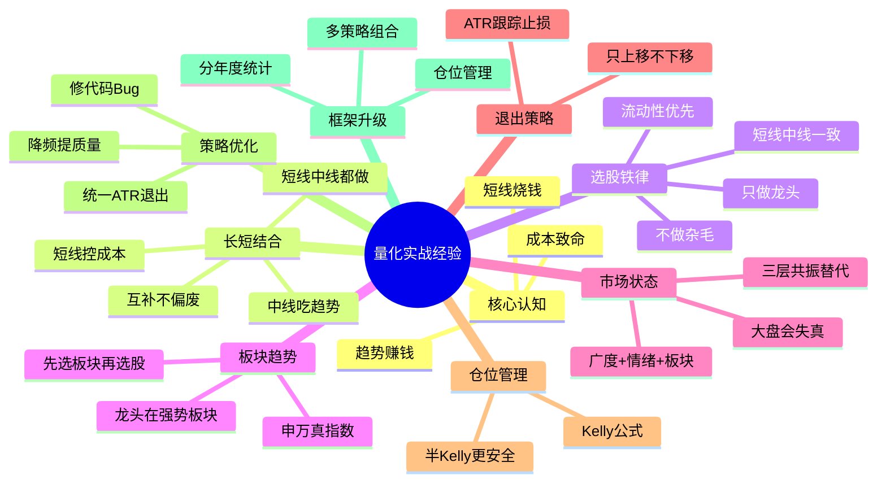

# 量化交易实战经验总结

> 基于本项目9个策略 × 30只A股 × 5年回测（2021-2026）验证得出

---

## 经验脑图



---

## 一、核心认知：趋势赚钱，短线烧钱

### 1.1 回测数据证明

```
策略          持仓周期    5年收益    年交易数    年成本占比    结论
──────────────────────────────────────────────────────────────
MA            ~30天      +2.9%      12次/年   2.2%       中线但退出差
ADX           ~25天      -4.7%      14次/年   2.5%       中线回撤最低19%
Turtle        ~20天      +3.8%      18次/年   3.2%       中线逻辑对
MACD          ~15天      +14%       24次/年   4.3%       最好的一个
RSI           ~8天       +11.6%     45次/年   8.1%       偏短线
KDJ           ~5天       -30%       72次/年   26%        短线亏钱
OBV           -          -16%       -         -          无效
```

### 1.2 成本是短线策略的致命伤

```
单边手续费 = 佣金万3 + 印花税千1(卖出) + 过户费 + 滑点 ≈ 0.18%

  中线策略: 24次/年 × 0.36%(双边) = 8.6% 年成本   ← 可接受
  短线策略: 72次/年 × 0.36%(双边) = 26%  年成本   ← 吃光利润

  KDJ 5年亏30%，其中26%是手续费
  → 如果0手续费，KDJ可能只亏-4%
  → 短线策略年收益必须超过50%才能盈亏平衡
```

### 1.3 趋势策略的数学优势

```
趋势策略: 一次大利润覆盖多次小止损
  一波行情赚30%，止损3次各亏3% = 30% - 9% - 1% = +20%

短线策略: 小利润高频次，成本海量
  每次赚2%，亏1次3%，做10次 = 20% - 3% - 18% = -1%

结论: 市场上赚钱的都是玩趋势，短线太凶狠要果断
```

---

## 二、中线 vs 短线策略对比

### 2.1 核心差异表

| 维度 | 中线策略 | 短线策略 |
|------|---------|---------|
| 持仓周期 | 2周~3个月 | 1~5天 |
| 年交易次数 | 10~20次 | 100~250次 |
| 年成本占比 | ~4% | ~45%+ |
| 胜率范围 | 35~45% | 50~60% |
| 盈亏比 | 2:1~4:1 | 1:1~1.5:1 |
| 核心指标 | 盈亏比 > 胜率 | 胜率 > 盈亏比 |
| 最大风险 | 利润回吐 | 成本吃光利润 |
| 优化重点 | 改退出(减少回吐) | 降频+降本 |
| 适合市场 | 趋势市 | 震荡市(但成本高) |

### 2.2 期望值对比

```
中线: 胜率40%, 盈亏比2.5
  每笔期望 = 0.40×2.5 - 0.60×1 = +0.40R
  年期望 = 0.40 × 20次 = 8R
  扣成本: 8R - 4% ≈ +4%

短线: 胜率55%, 盈亏比1.2
  每笔期望 = 0.55×1.2 - 0.45×1 = +0.21R
  年期望 = 0.21 × 100次 = 21R
  扣成本: 21R - 45% ≈ -24%  ← 成本吃光利润
```

---

## 三、退出策略是最大杠杆点

### 3.1 当前退出方式的问题

```
策略        退出方式          问题
──────────────────────────────────────
MACD        死叉退出          利润回吐50%+
MA          均线死叉退出       滞后严重
RSI         超买退出           利润薄
Turtle      10日低点突破       震荡市反复止损
OBV         OBV下穿均线        5年-16%，无效
ADX         -DI穿越+ADX跌破    退出也滞后
KDJ         死叉/ATR止损       ATR太紧被洗(已验证3.5×ATR最好)
TrendRider  ATR跟踪止损       ← 已验证有效
```

### 3.2 ATR跟踪止损是统一解法

```
入场: 各策略自己的信号 (保持差异)
退出: 统一ATR跟踪止损 (3.5×ATR, 只上移)

核心原则:
  1. 止损线只往有利方向移动（上移），不下移
  2. 趋势没结束就不走，不被小波动洗出
  3. 触碰止损 = 机械执行，不分析、不犹豫

ATR倍数选择:
  ADX > 30 (强趋势)  → 3.0~3.5×ATR (宽止损，吃满趋势)
  ADX 20-30 (弱趋势) → 2.0×ATR (适中)
  ADX < 20 (震荡市)  → 不交易
```

### 3.3 已验证的数据

```
KDJ+ATR (3.5×ATR) 在宁德时代:
  收益 +130%, 盈亏比 3.65, 胜率 40%  ← 趋势市表现好

KDJ+ATR (3.5×ATR) 在平安银行:
  收益 -5%, 盈亏比 0.86  ← 震荡市表现差

→ ATR止损在趋势市有效，震荡市需要ADX过滤
```

---

## 四、市场状态决定策略选择

### 4.1 A股2021-2026市场特征

```
上证指数:  3500 → 3300  (横盘震荡)
沪深300:   5500 → 3900  (跌29%, 熊市)
创业板指:  3100 → 2100  (跌32%, 但中间有反弹)
中证1000:  7000 → 6000  (跌14%, 小盘相对抗跌)

→ A股这5年是熊市/震荡市
→ 趋势策略在熊市中频繁假突破
→ 均值回归(RSI/KDJ)在震荡市有优势，但成本太高
→ 最佳方案: ADX判断市场状态，趋势市才做趋势策略
```

### 4.2 ADX是最有效的市场状态过滤器

```
ADX策略5年回撤只有19%，所有策略中最低
→ 说明ADX判断市场状态是有效的

过滤规则:
  ADX > 25  → 趋势市 → 用MACD/TrendRider/Turtle
  ADX < 20  → 震荡市 → 空仓或RSI(降频后)
  ADX 20-25 → 不明朗 → 空仓等待
```

---

## 五、仓位管理是降回撤的关键

### 5.1 满仓进出是回撤根源

```
当前: 100%仓位进出
  → 单笔亏损6% = 组合回撤6%
  → 连续3笔亏损 = 回撤18%
  → 这就是为什么所有策略回撤都在27-45%

改为30%仓位:
  → 单笔亏损6% × 30% = 组合回撤1.8%
  → 连续5笔亏损 = 回撤9% (vs 满仓30%)
  → 收益降到30%，但Sharpe可能更高
```

### 5.2 Kelly公式定仓位

```
f* = (p × b - q) / b

  p = 胜率, q = 1-p, b = 盈亏比

  胜率40%, 盈亏比3:1 → 满Kelly = 20%, 半Kelly = 10%
  胜率55%, 盈亏比3:1 → 满Kelly = 36.7%, 半Kelly = 18.3%

用半Kelly而非满Kelly: 实际胜率和盈亏比是估计值，半Kelly更安全
```

---

## 六、代码级Bug和隐患

### 6.1 已发现的问题

| # | 问题 | 文件 | 严重度 |
|---|------|------|--------|
| 1 | 日期硬编码 `20260101`-`20260818`，`--start/--end`被忽略 | `optimize.py:64` | 高 |
| 2 | ATR计算重复三份，改一个忘改另外两个 | `trend_rider.py` / `kdj.py` / `adx.py` | 中 |
| 3 | KDJ死参数 `ma_period` 还在params里但代码不用 | `kdj.py:84` | 低 |
| 4 | `optimize.py` 的 `PARAM_GRIDS` 缺少kdj和trend_rider | `optimize.py:28-36` | 高 |
| 5 | RSI阈值40/60非标准（标准30/70），信号多但质量低 | `rsi.py:55` | 中 |
| 6 | `batch_backtest.py` 没有传 `sl_stop/tp_stop` | `batch_backtest.py:55-63` | 中 |
| 7 | Regime策略MA画在副图不在主图 | `regime.py:79-82` | 低 |
| 8 | Turtle进出场用同一周期(20/20)，经典是20/10 | `turtle.py:9` | 中 |
| 9 | 成本模型不精确（无最小手续费、无过户费区分） | `run.py:41-42` | 低 |

### 6.2 框架级缺失

```
缺失功能:
  ✗ 无仓位管理 (vectorbt支持size参数，加一行即可)
  ✗ 无分年度统计 (只有full/train/test三段)
  ✗ 无组合回测 (1策略×1股票，无多策略组合净值)
  ✗ 无并行执行 (810次回测串行跑很慢)
  ✗ 无指数/ETF数据支持 (fetcher.py只支持个股)
  ✗ 无成交量确认 (9个策略没有一个看量价配合)
  ✗ 无信号强度分级 (STRATEGY_GUIDE.md写了但没实现)
```

---

## 七、策略优化优先级

### 7.1 紧急修复（代码bug）

```
① 修复optimize.py日期硬编码          — 1行改动
② 给optimize.py加kdj/trend_rider网格  — 2行
③ 修复regime.py MA画错位置           — 2行改动
④ 清理KDJ死参数ma_period             — 删几行
⑤ 统一ATR计算到base.py              — 消除三份重复
```

### 7.2 高收益改进（策略逻辑）

```
⑥ MACD/Turtle/RSI/MA统一加ATR止损    — 改4个文件
   → 预期盈亏比从0.8提到2+
   → 这是收益提升最大的单点改动

⑦ RSI阈值改回30/70                   — 1行
   → 信号减半，质量提升

⑧ Turtle改经典20/10参数              — 1行
   → 快进慢出，减少假突破

⑨ 给所有策略加ADX过滤                — 每个策略加几行
   → 震荡市不做趋势策略
   → 预期交易次数减半，假信号过滤

⑩ 加成交量确认过滤                   — 每个策略加几行
   → 放量信号才有效
```

### 7.3 框架升级

```
⑪ 加仓位管理(size参数)               — run.py改几行
   → 回撤从40%降到15%

⑫ 加分年度统计                       — batch_backtest.py
   → 知道策略在牛/熊/震荡分别表现

⑬ 加并行执行                         — batch_backtest.py
   → 810次回测从30分钟降到5分钟

⑭ 加指数数据支持                     — fetcher.py
   → 可回测指数/ETF
```

---

## 八、不建议现在做的

| 优化点 | 原因 |
|--------|------|
| 参数优化器 | 容易过拟合，先确认策略逻辑对再优化参数 |
| 蒙特卡洛 | 锦上添花，不是当前瓶颈 |
| 扩展到100+股票 | 数据成本高，30只够验证逻辑 |
| 分钟级数据 | T+1限制下意义不大 |
| 基本面因子 | 复杂度高，当前框架不支持 |
| 游资打板策略 | 需要分时数据+涨停板标记+情绪指标，数据成本高，回测困难（涨停板买不到） |

---

## 九、游资战法 vs 量化框架

### 9.1 两种体系对比

```
量化趋势策略:           游资打板战法:
  日K线级别               日内/隔日级别
  持仓数周到数月          持仓1-3天
  信号: 金叉/突破/超买超卖  信号: 涨停板+量能+情绪周期
  年交易10-20次           年交易100+次
  年成本~4%              年成本~45%+
  适合: 大资金            适合: 小资金
```

### 9.2 游资战法量化难点

```
需要的数据 (当前都不支持):
  ① 分时数据（1分钟/5分钟）
  ② 涨停板标记
  ③ 连板数统计
  ④ 板块/题材分类
  ⑤ 市场情绪指标（涨停家数/跌停家数/连板高度）

回测陷阱:
  → 涨停板买不到是常态，回测假设涨停价能买到会高估收益
  → 情绪周期(冰点/发酵/高潮/退潮)主观性强，难量化
```

---

## 十、关键经验总结

### 10.1 五条铁律

```
1. 趋势赚钱，短线烧钱 — 短线成本高，但长短都做，短线靠降频+控成本活下来
2. 退出比入场重要 — ATR跟踪止损是最大杠杆点
3. 不分市场状态的策略都是耍流氓 — ADX过滤是必须的
4. 满仓进出是回撤根源 — 仓位管理能降回撤60%+
5. 先验证逻辑再优化参数 — 过拟合比没有策略更危险
```

### 10.2 长短线策略配置建议

```
核心原则: 长短结合，都做，不偏废。但都只做龙头、都控制成本。

长线/中线策略 (吃趋势):
  ✓ MACD       — 收益最好，改ATR退出即可
  ✓ Turtle    — 逻辑经典，改20/10参数
  ✓ MA         — 退出太差，改ATR退出
  ✓ TrendRider — 设计对了，验证即可
  ✓ ADX        — 回撤最低，做市场状态过滤器

短线策略 (控成本，降频后保留):
  ✓ RSI        — 阈值改30/70降频，震荡市辅助
  ✓ KDJ        — 加ADX过滤降频，短线补充
  ✗ OBV        — 5年-16%无效，删除或重写
  ? Regime     — 概念好但实现粗糙，需重写

长短线互补逻辑:
  中线(MACD/Turtle)  → 吃主升浪大利润, 低频低成本
  短线(RSI/KDJ)      → 抓板块轮动小机会, 降频后控成本
  ADX                → 判断市场状态, 分配长短线权重

  不死扛某一类, 也不拒绝某一类:
    趋势市 → 中线权重高 (70%)
    震荡市 → 短线权重高 (但必须降频, 否则成本吃光)
    不明朗 → 都降仓, 等信号
```

> 注意: 拒绝的不是"短线策略"本身，而是"高频烧成本的短线"。
> 短线通过降频(年交易<30次)+控成本(限价单+低滑点)后，仍有配置价值。

### 10.3 优化执行顺序

```
第1步: 修bug (①-⑤)                    — 半天
第2步: 统一ATR退出 (⑥)                — 1天，收益提升最大
第3步: ADX过滤 (⑨)                    — 1天，降频+提质量
第4步: 仓位管理 (⑪)                   — 半天，降回撤
第5步: 分年度统计 (⑫)                 — 半天，用数据说话
第6步: 多策略组合                     — 2-3天，最终目标
```

---

## 十一、选股铁律：只做龙头，不做杂毛

### 11.1 核心原则

```
无论短线还是中线，选股只追求一件事：流动性（辨识度）。
  → 只做龙头股，不做杂毛股
  → 龙头 = 板块最强、成交最大、关注度最高
  → 杂毛 = 跟风的、成交稀薄的、没人看的
```

**为什么这是第一原则（比策略选择更底层）：**

```
龙头 vs 杂毛:

              龙头股                    杂毛股
成交量        日均10亿+                  日均1亿以下
买卖冲击      滑点小(<0.1%)             滑点大(0.5%+)
涨跌停        封板坚决, 进出容易          封板犹豫, 被砸即开
资金关注      大资金进出自由              大资金进不去/出不来
趋势持续性    一波主升浪清晰              涨一天跌三天
信号质量      突破是真突破                突破大概率是假突破
```

### 11.2 龙头的流动性溢价

```
流动性 = 生命力

  短线: 打板要有人接盘 → 龙头次日溢价高, 杂毛次日闷杀
        龙头: 涨停封死, 次日高开有人接力 → 赚钱
        杂毛: 涨停烂板, 次日低开没人接 → 亏钱

  中线: 趋势要有人跟随 → 龙头主升浪流畅, 杂毛磨磨唧唧
        龙头: 资金抱团, 趋势清晰, ATR跟踪止损能吃到
        杂毛: 没人关注, 横盘震荡, 止损反复被扫

  → 同样一个MACD金叉信号:
     在龙头股上: 胜率45%, 盈亏比3:1
     在杂毛股上: 胜率30%, 盈亏比1:1
  → 选股层的收益差距, 比策略层更大
```

### 11.3 短线和中线对龙头的要求一致

```
传统认知误区:
  短线做龙头, 中线做价值  ← 这是错的

正确认知:
  短线只做龙头(流动性)  ← 有人接盘才能出货
  中线也只做龙头(流动性) ← 有量才有趋势, 无量不趋势

  区别只在于:
    短线: 龙头刚启动(首板/二板)就进, 1-3天走
    中线: 龙头主升浪中进, 持有到趋势结束

  共同前提: 必须是有流动性、有辨识度的龙头
```

### 11.4 如何定义"龙头"（量化筛选）

```
龙头股的量化特征 (每日筛选):

  ① 成交额排名: 全市场前5% (日均成交 > 行业均值3倍)
  ② 涨幅排名:   板块内当日涨幅前3
  ③ 换手率:     3%-15% (太低没量, 太高出货)
  ④ 板块地位:   板块启动日率先涨停/领涨
  ⑤ 连板高度:   有连板梯队(至少2板)才确认主线

  杂毛的特征 (直接排除):
    ✗ 日均成交 < 2亿
    ✗ 板块内跟涨(龙头涨它才涨, 龙头跌它先跌)
    ✗ 无辨识度(没有机构/游资关注)
    ✗ ST / 退市风险 / 流动性枯竭
```

### 11.5 龙头战法与现有框架的结合

```
当前框架是日K趋势/震荡策略 (中线为主)
→ 天然适合做"龙头主升浪的中线持有"

改造方向:
  1. 选股层: 先筛龙头 (成交额前5% + 板块领涨)
  2. 策略层: 在龙头股上跑MACD/Turtle/ADX
  3. 退出层: ATR跟踪止损, 吃满主升浪
  4. 风控层: 龙头跌破趋势 = 立即走, 不恋战

  预期效果:
    杂毛股MACD: 胜率30%, 盈亏比1:1  → 亏
    龙头股MACD: 胜率45%, 盈亏比3:1  → 赚
    → 选股层改造比策略层改造收益更大
```

### 11.6 选股铁律的优先级

```
交易决策优先级 (从高到低):

  1. 选股: 只做龙头, 流动性第一     ← 最底层, 决定生死
  2. 市场状态: ADX过滤, 震荡不做    ← 决定方向
  3. 策略: MACD/Turtle趋势为主      ← 决定买卖点
  4. 退出: ATR跟踪止损              ← 决定赚多少
  5. 仓位: 半Kelly                  ← 决定回撤

  → 选错股 (杂毛), 后面全错
  → 选对股 (龙头), 即使策略粗糙也能赚
```

---

## 十二、中期交易策略设计方案（仅设计，未实现）

> 本节是中期量化的完整设计方案，整合前十一章经验。
> 状态：设计稿，未编码、未回测。落地优先级见 12.6。

### 12.1 策略定位

```
中期量化 = 持仓2周~3个月 · 日K级别 · 趋势策略为主
         · 只做龙头 · 板块趋势确认 · ATR退出 · 半Kelly仓位

数据周期: 日K为主 + 周线方向过滤(轻量, 策略内resample)
标的范围: 申万一级行业(31个)内的龙头股
风格:    长短都做, 但本期聚焦中线; 短线降频后保留
```

### 12.2 自上而下四层过滤架构

```
┌─────────────────────────────────────────────────────────┐
│ 第一层: 市场状态 (能不能做)                                │
│   情绪分位 + 个股广度 + 板块温度, 三层共振                  │
│   不依赖单一宽基指数(防失真)                               │
├─────────────────────────────────────────────────────────┤
│ 第二层: 板块趋势 (做哪个方向)                              │
│   申万31行业指数 MA20向上 + 近20日动量>0                   │
│   选 3-5 个强势板块                                        │
├─────────────────────────────────────────────────────────┤
│ 第三层: 板块内龙头 (买谁)                                  │
│   板块内 成交额前3 + 涨幅前3 + 换手率3%-15%                │
├─────────────────────────────────────────────────────────┤
│ 第四层: 个股信号 (买点) + 量价确认                        │
│   MACD/Turtle金叉 + 量比>1.2 + 周线方向向上               │
│   退出: ATR跟踪止损(3.0×, 只上移)                         │
└─────────────────────────────────────────────────────────┘
```

### 12.3 第一层：市场状态（应对大盘失真）

```
原设计问题: ADX(大盘) > 25 当闸门, 但大盘失真时误判
  (指数被权重股拉抬, 个股其实在跌)

改用三层共振, 任一失真相不误导:

A. 个股广度 (替代大盘点位)
   全市场站上20日线的个股占比
     > 60%  → 多头市
     30-60% → 震荡市
     < 30%  → 空头市

B. 情绪温度 (分位法, 防绝对数失真)
   涨停家数 / 跌停家数, 取近60日分位
     分位 40-80% → 健康, 正常做
     > 80%      → 过热, 减仓不追
     < 20%      → 冰点, 空仓等拐点

C. 板块温度 (用已建sectors.py)
   31行业中 MA20向上的占比
     > 50% → 有主线, 可做
     < 30% → 无主线, 休息

开仓条件: A/B/C 满足任意2个 → 允许开仓
背离信号: 指数涨但广度跌 = 最危险(诱多), 不追高
```

### 12.4 第二层+第三层：板块趋势与龙头筛选

```
板块趋势 (第二层):
  数据源: data/sectors.py 已建成
  判定: 申万行业指数 MA20向上 AND 近20日动量>0
  输出: 强势板块列表(取前3-5)

龙头筛选 (第三层, 板块内):
  ① 成交额: 板块内前3 (日均成交>行业均值3倍)
  ② 涨幅:   板块内当日前3
  ③ 换手率: 3%-15% (太低没量, 太高出货)
  ④ 板块地位: 板块启动日率先领涨
  排除: 日均成交<2亿 / ST / 流动性枯竭

→ 输出: 候选龙头股池 (通常每板块1-2只)
```

### 12.5 第四层：个股信号 + 量价 + 退出

```
入场信号 (个股):
  MACD金叉 OR Turtle突破(20日)  ← 二选一或并集
  + 量比 > 1.2 (放量确认, 过滤假突破)  ← 成交量因子
  + 周线MA20向上 (周线方向过滤)        ← 防日线抄底
  + 所属板块在第二层强势列表中

退出 (统一ATR跟踪止损):
  止损线 = 持仓最高价 - 3.0×ATR
  止损线只上移不下移
  ADX>30强趋势 → 3.5×ATR (吃满)
  ADX<20      → 不持仓

仓位 (半Kelly):
  胜率40% 盈亏比3:1 → 满Kelly20%, 半Kelly10%
  信号分级: A级满仓系数, B级半仓, C级不做
```

### 12.6 落地优先级（设计稿，待批准后实施）

```
P0 数据层 (已完成):
  ✓ data/sectors.py 申万31行业指数+映射  ← 已建

P1 因子层 (待做):
  ① 市场状态三层共振 (广度+情绪+板块温度)
  ② 个股量比确认 (_volume_confirm)
  ③ 周线方向过滤 (resample)

P2 选股层 (待做):
  ④ 板块趋势筛选 → 龙头股池

P3 策略层 (待做):
  ⑤ MACD/Turtle 接入统一ATR退出 + 量价确认 + 板块闸门

P4 验证层 (待做):
  ⑥ 单只龙头回测跑通+看板
  ⑦ 批量30只+分年度统计
  ⑧ 多策略组合净值
```

### 12.7 关键设计决策记录

```
Q: 板块用真指数还是合成?
A: 真指数 (申万一级31个, 数据干净), 已落地 data/sectors.py

Q: 大盘失真如何处理?
A: 弃用单一宽基ADX, 改 广度+情绪+板块 三层共振

Q: 情绪因子如何处理?
A: 分位法(近60日), 不直接用绝对涨停家数; 角色=开仓闸门

Q: 成交量因子如何处理?
A: 个股量比>1.2 作入场确认; 放巨量滞涨作离场预警

Q: 长短线如何取舍?
A: 都做不偏废; 短线降频(年交易<30次)+控成本后保留
```

---

## 十三、因子处理细则（情绪 / 成交量）

### 13.1 情绪因子

```
三层情绪:
  ① 市场情绪: 涨停/跌停家数比, 近60日分位
  ② 板块情绪: 主线板块涨停密度 (板块内涨停数/成分股数)
  ③ 个股情绪: 目标股封单额/流通市值>3%, 量比>3

用法 = 开仓闸门 (不是买卖信号):
  分位 40-80% → 正常做
  > 80%      → 过热减仓, 不追
  < 20%      → 冰点空仓, 等拐点

数据源 (akshare):
  ak.stock_zt_em(date)   当日涨停列表(含封单额)
  ak.stock_dt_em(date)   当日跌停列表
  ak.stock_board_concept_spot_em()  概念板块涨停数
```

### 13.2 成交量因子

```
两个维度:
  A. 个股量能 (本期重点): 量价配合确认信号
  B. 市场整体量能: 两市成交额 (>1.5万亿增量市, <7000亿减量市)

个股量比量化:
  量比 = volume / 20日均量
  量比 > 1.2 且突破  → 真突破, 入场
  量比 < 0.8 且涨    → 无量上涨, 不追
  量比 > 3 且长上影  → 出货, 离场

在策略中的位置:
  入场过滤: signal & (量比>1.2)        ← 补9策略缺口
  持仓监控: 放巨量长上影 → 减仓一半
  离场增强: 缩量跌回突破位 → 假突破即走

代码落点 (设计):
  BaseStrategy._volume_confirm(df, min_ratio=1.2)
  entries = signal & self._volume_confirm(df)
```

### 13.3 两因子 + 个股信号的层次关系

```
情绪因子 (宏观闸门)   成交量因子 (微观确认)   个股信号 (执行)
─────────────────   ───────────────────   ──────────
情绪分位40-80%  ─┐
板块温度>50%    ─┤→ 量比>1.2 (真突破) ─┐
(允许做)        │                      ├→ MACD金叉 → 买入
                ┘                      └→ 量比<0.8/巨量滞涨 → 不买/卖

三者上下游, 非替代:
  情绪差 → 直接空仓
  情绪好 → 看量价确认
  量价齐升 → 执行入场
```

---

## 十四、中期因子设计（回测输入）

> 基于第十二章四层架构，把所有因子定义为可回测的计算单元。
> 标注: ✓=数据已齐可直接回测, △=需补充下载, ✗=暂不可回测
> 数据来源: fetcher.py(个股OHLCV) + sectors.py(申万31行业指数/映射)

### 14.1 因子总表

```
层级    因子ID  因子名           计算                                 阈值/方向      数据
────────────────────────────────────────────────────────────────────────────────────
闸门1   F1     个股广度         站上20日线个股占比                  >60%多/<30%空  △样本池
        F2     情绪分位         涨停/跌停比近60日分位               40-80%做/<20%空 △逐日zt/dt
        F3     板块温度         31行业中MA20向上占比                >50%有主线     ✓sectors
────────────────────────────────────────────────────────────────────────────────────
板块2   F4     板块MA趋势      行业指数收盘>MA20                   True=强势      ✓sectors
        F5     板块动量         行业指数近20日收益率                >0=向上        ✓sectors
────────────────────────────────────────────────────────────────────────────────────
龙头3   F6     板块内成交额排名 个股成交额/板块内分位              前3            ✓(30只池)
        F7     板块内涨幅排名   个股当日涨幅/板块内排名             前3            ✓(30只池)
        F8     换手率区间       当日换手率                         3%-15%         ✓fetcher
        F9     流动性门槛       日均成交额                         >2亿           ✓fetcher
────────────────────────────────────────────────────────────────────────────────────
信号4   F10    MACD金叉        DIF上穿DEA                          金叉=买入      ✓fetcher
        F11    Turtle突破      收盘价>20日最高                     突破=买入      ✓fetcher
        F12    周线方向        周线收盘>周MA20                     向上=放行      ✓resample
        F13    量比确认         volume/20日均量                    >1.2放量       ✓fetcher
────────────────────────────────────────────────────────────────────────────────────
退出    F14    ATR跟踪止损      止损线=最高价-3.0×ATR,只上移       触碰=卖出      ✓fetcher
        F15    量价背离退出     缩量跌回突破位                     假突破=卖出    ✓fetcher
```

### 14.2 各因子详细定义

**F1 个股广度 (△需样本池)**
```
输入: 股票池每日收盘价 + 20日MA
计算: count(close > MA20) / total × 100%
分层: >60% 多头市 | 30-60% 震荡 | <30% 空头
回测: 用现有30只样本池可算(但30只偏大盘, 可能失真)
      全市场回测需下载全A(数据量大)
```

**F2 情绪分位 (△需逐日涨停跌停)**
```
输入: 每日涨停家数zt / 跌停家数dt
计算: ratio = zt / max(dt,1); 取近60日分位
分层: 分位40-80% 健康做 | >80% 过热减仓 | <20% 冰点空仓
回测: ak.stock_zt_em(date)/stock_dt_em(date) 按日下载, 存时间序列
```

**F3 板块温度 (✓)**
```
输入: sectors.py 31行业指数日K
计算: count(行业指数收盘>MA20) / 31 × 100%
分层: >50% 有主线可做 | <30% 休息
回测: 直接读 sectors/*.csv, 无需新下载
```

**F4/F5 板块趋势 (✓)**
```
F4: 行业指数 close > MA20 → 该行业当日"强势"
F5: 行业指数 pct_change滚动20日累计 > 0 → 动量向上
组合: F4&F5 同时True → 入选强势板块列表(取前3-5)
回测: 读 sectors/*.csv 逐行业算, 输出每日强势板块集合
```

**F6-F9 龙头筛选 (✓ 限30只样本池)**
```
F6: 在入选强势板块内, 个股成交额 / 板块内所有个股成交额 → 分位前3
F7: 板块内当日涨幅排名前3
F8: 0.03 <= turnover_rate <= 0.15
F9: 20日均成交额 > 2e8
组合: F6/F7满足其一 + F8 + F9 → 候选龙头股池
注意: 仅覆盖 stock_list.csv 中属于该板块的个股(可能不全)
```

**F10/F11 个股信号 (✓)**
```
F10: MACD(DIF, DEA) DIF上穿DEA
F11: close > rolling(20).max().shift(1) (唐奇安突破)
组合: F10 OR F11 = 基础买入信号
```

**F12 周线方向 (✓ 轻量)**
```
输入: 个股日K resample('W').last()
计算: 周收盘 > 周MA20
作用: 周线向下时, 日线金叉不入场(防抄底)
```

**F13 量比确认 (✓)**
```
输入: fetcher 个股 volume
计算: volume / volume.rolling(20).mean()
作用: 信号日量比>1.2 才确认(过滤无量假突破)
```

**F14 ATR跟踪止损 (✓)**
```
输入: fetcher high/low/close
计算: ATR(14); 持仓中止损线=max(最高价,-3.0×ATR), 只上移
      ADX>30 → 3.5×ATR(吃满); ADX20-30 → 2.0×ATR
触碰止损线 → 卖出
```

**F15 量价背离退出 (✓)**
```
输入: 个股 close + volume + 突破位(入场价)
条件: 价格跌回入场突破位 且 当日量比<0.8 → 假突破, 立即卖
```

### 14.3 回测可用矩阵

```
✓ 立即可回测 (数据齐):
   F3 板块温度, F4/F5 板块趋势, F6-F9 龙头(限30只池),
   F10/F11 信号, F12 周线, F13 量比, F14/F15 退出

△ 需补数据后回测:
   F1 个股广度 (需定样本池: 30只 or 全市场下载)
   F2 情绪分位 (需逐日下载涨停/跌停家数序列)

建议回测路径:
   第一轮(最小集): F3+F4+F5+F6-F9+F10/F11+F12+F13+F14
                   → 验证"板块趋势+龙头+量价+ATR"是否有效
   第二轮(加闸门): 补 F1+F2, 验证三层共振是否降回撤
```

### 14.4 因子模块设计（代码落点）

```
文件: framework/factors/ (因子库, 纯函数)
  market_state.py  → F1广度, F2情绪(默认未启用), F3板块温度
  sector_trend.py  → F4/F5 板块趋势筛选
  leader.py        → F6-F9 龙头筛选 (依赖sectors映射)
  signal.py        → MACD/F10, 周KDJ/F12, MA60, 量比/F13 个股信号
  exit.py          → F14 ATR跟踪止损, F15 量价背离退出, ADX

策略层(非重写回测器): framework/strategies/midterm.py
  MidTermStrategy(Strategy)  —— 继承抽象层, 复用 run.py/batch_backtest.py 引擎
  只负责生成 (entries, exits, indicators, size) 四元组, 回测由现有引擎执行

注: 早期曾误建 framework/backtest_midterm.py (重写回测器), 已删除。
    正确范式: 新策略一律继承 Strategy, 不重写回测器。
```

---

## 十五、中期策略指标分层 v2（完整设计）

> 整合"MACD + ATR + 周KDJ + 成交量 + 情绪因子 + MA + 龙头筛选"为七层闭环。
> 状态：设计稿 v2，未编码、未回测。由第十四章因子设计 + 指标分层讨论收敛而来。

### 15.1 从"5指标平级共振"到"七层闭环"

最初设想把 MACD/ATR/周KDJ/成交量/情绪 5 个指标**平级共振**，讨论中修正三处逻辑硬伤：

```
① ATR 是波动率、无方向 → 不能和 MACD 平级投票，降级为风控/仓位标尺
② 周KDJ 与 MACD 共线(均均线系动量) → 改双周期确认(周线定方向+日线定点)，非并列投票
③ 情绪是市场状态闸门，不是个股指标投票者 → 单独一层，不通过即空仓
```

并补回三处缺口（否则设计不完整）：
```
④ 龙头筛选层(铁律"只做龙头")  — 板块强势≠板块内任意股都能买
⑤ F15 量价背离退出            — ATR 触线滞后，需假突破早退
⑥ 半Kelly仓位 + 风控冷却      — 仓位公式与连损休息机制
```

### 15.2 七层架构

```
┌─────────────────────────────────────────────────────────────────┐
│ 第0层 闸门: 情绪因子 (F2/F3)                                      │
│   情绪分位40-80%做 / >80%过热减仓 / <20%冰点空仓                  │
│   不通过 → 直接空仓，不进下游                                      │
├─────────────────────────────────────────────────────────────────┤
│ 第1层 板块: 板块趋势 (F4/F5)                                      │
│   行业指数 close>MA20 且 近20日动量>0 → 强势板块(取3-5)          │
├─────────────────────────────────────────────────────────────────┤
│ 第2层 选股: 龙头筛选 (F6-F9)                                      │
│   强势板块内: (成交额前3 OR 涨幅前3) AND 换手3-15% AND 日均>2亿  │
│   → 候选龙头股池（排除ST/流动性枯竭）                              │
├─────────────────────────────────────────────────────────────────┤
│ 第3层 信号: 买卖点 (周KDJ+MACD+MA60+量比)                         │
│   周KDJ金叉(周线拐点) + MACD金叉(日线点)                          │
│   + close>MA60(多空分界) + 量比>1.2(放量确认)                    │
│   仅在「龙头股池 ∩ 上述信号」时触发                                │
├─────────────────────────────────────────────────────────────────┤
│ 第4层 环境: ADX+ATR (强度/波动标尺，不投票)                       │
│   ADX>30→强趋势(3.5×ATR) / 20-30→弱(2.0×) / <20→不持仓          │
├─────────────────────────────────────────────────────────────────┤
│ 第5层 退出: ATR跟踪 + F15量价背离                                  │
│   ATR触线(只上移) OR 缩量跌回突破位 OR 放量滞涨 → 卖              │
├─────────────────────────────────────────────────────────────────┤
│ 第6层 仓位/风控: 半Kelly + 分级 + 冷却                            │
│   半Kelly(按ADX系数) / A-B-C信号分级 / 连损2次休息5日 /          │
│   单笔≤5% / 组合回撤>15%降半仓 >25%空仓                          │
└─────────────────────────────────────────────────────────────────┘
```

### 15.3 因子总表（v2）

| 层 | 因子 | 计算 | 阈值/方向 | 数据 |
|----|------|------|----------|------|
| 闸门 | F2/F3 情绪·板块温度 | 涨停跌停分位 / 31行业MA20占比 | 40-80%做 | △逐日zt/dt / ✓sectors |
| 板块 | F4/F5 | close>MA20 & 动量>0 | True=强势 | ✓sectors |
| 选股 | F6-F9 | 成交额/涨幅前3 + 换手 + 流动性 | 前3/3-15%/>2亿 | ✓限30只池 |
| 信号 | 周KDJ | 周线K上穿D | 金叉 | ✓resample |
| 信号 | MACD | DIF上穿DEA | 金叉 | ✓fetcher |
| 信号 | MA60 | close>MA60 | 多空分界 | ✓fetcher |
| 信号 | F13 量比 | vol/20日均量 | >1.2 | ✓fetcher |
| 环境 | ADX+ATR | ADX趋势强度 / ATR波动 | >25做 | ✓fetcher |
| 退出 | F14 ATR | 最高价-3.0×ATR只上移 | 触线卖 | ✓fetcher |
| 退出 | F15 | 缩量跌回突破位/放量滞涨 | 早退 | ✓fetcher |
| 仓位 | 半Kelly | (p×b-q)/b /2 × ADX系数 | 组合占比 | 公式 |

### 15.4 关键分层规则（铁律落点）

```
闸门(情绪):   不通过直接空仓，不进下游
板块→选股:    强势板块内再筛龙头，不在强势板块 / 非龙头不买
信号:        仅在「龙头股池 ∩ 周KDJ+MACD+MA60+量比」时触发
环境(ADX+ATR):只定止损宽度与仓位，不参与方向投票
退出:        F15 早退优先于 ATR 触线
仓位:        半Kelly × ADX系数，A/B/C分级，连损冷却
```

### 15.5 回测可用矩阵与限制

```
✓ 立即可回测: F4/F5, F6-F9(限30只池), 周KDJ, MACD, MA60, F13,
             ADX/ATR, F14/F15
△ 需补数据:  F2/F3 情绪(逐日涨停跌停序列), F1 个股广度(样本池)
限制:        F6-F9 仅覆盖 stock_list.csv 30只，板块内可能不全
             → 第二轮需扩展股票池，否则龙头层样本不足选不出股
```

### 15.6 设计决策记录（v2）

```
Q: 5指标平级共振可行吗?
A: 不可行。ATR无方向、周KDJ与MACD共线、情绪是闸门非投票，须拆层。

Q: MA 放哪层?
A: 日线 MA60 作"多空分界/只允许做多"，不抢金叉投票，避免与MACD共线。

Q: ATR+ADX 是共振吗?
A: 不是方向共振，是"环境强度+波动标尺"，只定止损宽度与仓位。

Q: 龙头层为何必须?
A: 铁律"只做龙头"；实证龙头MACD胜率45%/盈亏比3:1 vs 杂毛30%/1:1。

Q: 退出为何加F15?
A: ATR触线滞后，F15抓缩量跌回突破位/放量滞涨的假突破早退。
```

### 15.7 代码落地（v2 已实现）

> 2026-08-24 完成编码。沿用框架抽象层，不重写回测器。

**新增文件**
```
framework/factors/__init__.py      因子包导出
framework/factors/signal.py        MACD(F10) / 周KDJ(F12) / MA60 / 量比(F13) / build_entries
framework/factors/exit.py          ATR(F14) 跟踪止损 / F15 量价背离 / ADX
framework/factors/market_state.py  F1 广度 / F3 板块温度 / F2 情绪(可选)
framework/factors/sector_trend.py  F4/F5 板块趋势
framework/factors/leader.py        F6-F9 龙头筛选
framework/strategies/midterm.py    MidTermStrategy(Strategy) —— 七层编排 + 第六层size
```

**改动文件**
```
framework/strategies/base.py       Strategy.run 契约扩展为可选返回 size(仓位比例)
framework/run.py / batch_backtest.py  解包兼容 (3元组→4元组), from_signals(size=...) 透传
data/fetcher 透传列                run.py/batch 行情列 5→6(增 amount/turnover_rate/symbol)
```

**第六层 size 实现（半Kelly × ADX系数 + 分级 + 连损冷却）**
```
size = 半Kelly(40%胜率3:1 → 10%) × ADX系数(强趋势1.0/弱0.6/<20=0) × 信号分级(A满/B半)
连损冷却: 连续退出亏损≥2次 → 强制休息 cooldown(默认5日), 期间不开新仓
返回与 df 等长的 size Series, 引擎仅在 entry 当日读取该值作为仓位
```

**已删除**
```
framework/backtest_midterm.py  (早期误建的重写回测器, 违反抽象层范式, 已删)
```

**验证状态**
```
✓ 单股 run() 返回四元组, size 计算无异常 (代码示例 000001 短区间)
✓ 架构: Strategy 子类 + 引擎零改动 (仅透传多几列)
⏳ 全量回测待执行 (用户要求先搞代码、暂未跑)
```

---

*最后更新: 2026-08-24*
*基于: 9策略 × 30只A股 × 2021-2026回测数据 + 申万板块数据模块*
